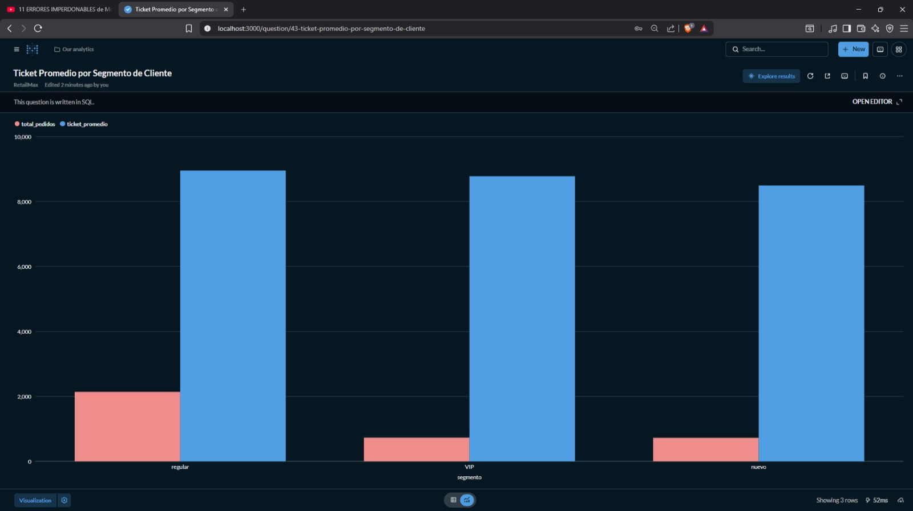
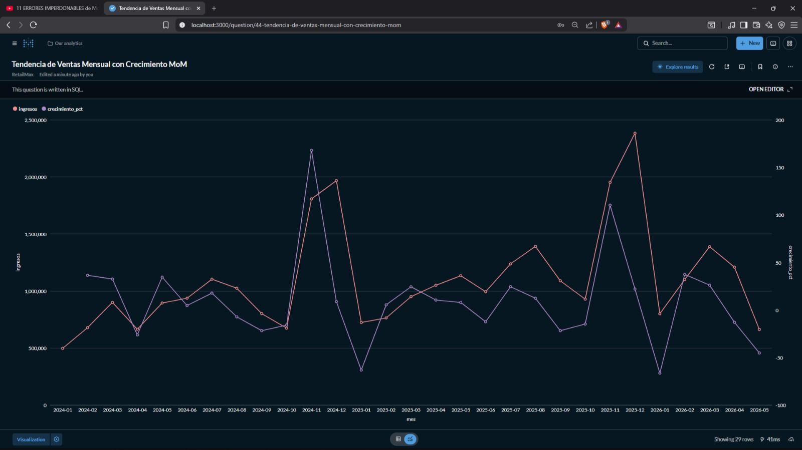
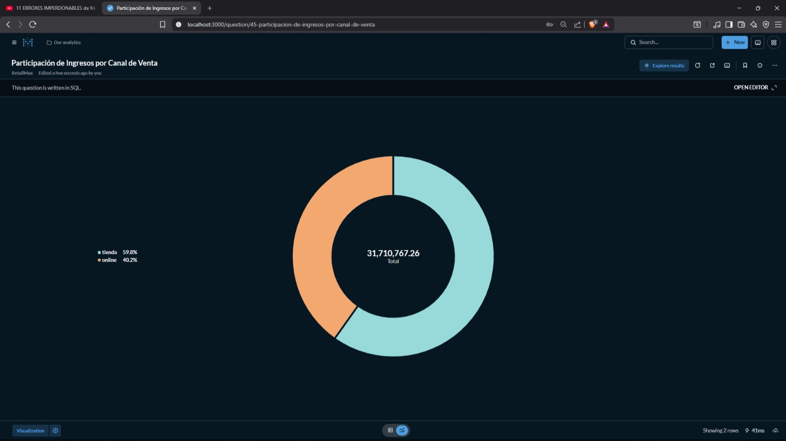

# Lab 7 — Visualización de Datos · RetailMax

**Curso:** CC3088 Bases de Datos 1 — Universidad del Valle de Guatemala  
**Área de negocio:** Ventas  
**Ciclo:** 1, 2026

---

## Video de presentación

> **[Insertar enlace al video aquí]**

---

## Cómo levantar el ambiente

```bash
docker compose up -d
```

Esperar ~60 segundos a que Metabase inicialice, luego abrir **http://localhost:3000**.

**Credenciales de calificación:**

| Campo | Valor |
|-------|-------|
| Correo | calificar@uvg.edu.gt |
| Contraseña | secret123+ |

> El dashboard aparece precargado al abrir Metabase. No se requiere ningún paso adicional.

---

## Estructura del repositorio

```
├── docker-compose.yml       # Ambiente completo (PostgreSQL + Metabase)
├── DDL.sql                  # Esquema de la base de datos
├── DATA.sql                 # Datos de prueba
├── metabase-data/           # Volumen persistido con el dashboard construido
├── informe.pdf              # Documentación completa de los 12+ indicadores
└── README.md
```

---

## Dashboard

El dashboard **"Dashboard Ventas"** contiene 2 tabs con 6 indicadores cada uno.

---

### Tab 1 — Rendimiento de Ventas

---

#### KPI 1 — Ventas Totales

**Qué representa:**  
Total de ingresos generados por todos los pedidos completados.

**Importancia para el área:**  
Permite medir el desempeño general del área de ventas y evaluar el volumen total de ingresos del negocio.

**Visualización:** Big Number — permite visualizar rápidamente el indicador financiero principal del dashboard.


**Consulta SQL:**
```sql
SELECT
    ROUND(SUM(
        dp.cantidad * dp.precio_unitario * (1 - dp.descuento / 100.0)
    ), 2) AS ventas_totales
FROM detalle_pedido dp
JOIN pedido p
    ON dp.id_pedido = p.id_pedido
WHERE p.estado = 'completado';
```

---

#### KPI 2 — Ventas por Mes

**Qué representa:**  
Evolución mensual de las ventas generadas por pedidos completados.

**Importancia para el área:**  
Permite identificar tendencias, crecimiento, caídas y comportamientos estacionales en las ventas.

**Visualización:** Line Chart — ideal para visualizar cambios y tendencias a lo largo del tiempo.


**Consulta SQL:**
```sql
SELECT
    DATE_TRUNC('month', p.fecha) AS mes,
    ROUND(SUM(
        dp.cantidad * dp.precio_unitario * (1 - dp.descuento / 100.0)
    ), 2) AS ventas
FROM detalle_pedido dp
JOIN pedido p
    ON dp.id_pedido = p.id_pedido
WHERE p.estado = 'completado'
GROUP BY mes
ORDER BY mes;
```

---

#### KPI 3 — Top 10 Productos Más Vendidos

**Qué representa:**  
Los productos que generan mayores ingresos dentro de los pedidos completados.

**Importancia para el área:**  
Identifica qué productos tienen mejor desempeño comercial y cuáles generan más ingresos para la empresa.

**Visualización:** Bar Chart — facilita comparar visualmente el rendimiento entre distintos productos.


**Consulta SQL:**
```sql
SELECT
    pr.nombre AS producto,
    ROUND(SUM(
        dp.cantidad * dp.precio_unitario * (1 - dp.descuento / 100.0)
    ), 2) AS ingresos
FROM detalle_pedido dp
JOIN pedido p
    ON dp.id_pedido = p.id_pedido
JOIN producto pr
    ON dp.id_producto = pr.id_producto
WHERE p.estado = 'completado'
GROUP BY pr.nombre
ORDER BY ingresos DESC
LIMIT 10;
```

---

### Tab 2 — Análisis de Clientes y Canales

---

#### KPI 4 — Ticket Promedio por Segmento de Cliente

**Qué representa:**  
Valor promedio de cada pedido completado, agrupado por segmento de cliente (VIP, regular, nuevo).

**Importancia para el área:**  
Permite identificar cuánto gasta en promedio cada tipo de cliente y priorizar esfuerzos de retención y upselling en los segmentos de mayor valor.

**Visualización:** Bar Chart — ideal para comparar valores discretos entre categorías.



**Consulta SQL:**
```sql
SELECT
    c.segmento,
    COUNT(DISTINCT p.id_pedido) AS total_pedidos,
    ROUND(
        AVG(sub.valor_pedido)::numeric, 2
    ) AS ticket_promedio
FROM cliente c
JOIN pedido p ON c.id_cliente = p.id_cliente
JOIN (
    SELECT
        id_pedido,
        SUM(cantidad * precio_unitario * (1 - descuento / 100.0)) AS valor_pedido
    FROM detalle_pedido
    GROUP BY id_pedido
) sub ON p.id_pedido = sub.id_pedido
WHERE p.estado = 'completado'
GROUP BY c.segmento
ORDER BY ticket_promedio DESC;
```

---

#### KPI 5 — Tendencia de Ventas Mensual con Crecimiento MoM

**Qué representa:**  
Ingresos netos por mes y el porcentaje de crecimiento respecto al mes anterior (Month over Month).

**Importancia para el área:**  
Permite detectar estacionalidad, tendencias de aceleración o desaceleración, y meses críticos para anticipar acciones comerciales.

**Visualización:** Line Chart — muestra la evolución temporal; el % de crecimiento añade una segunda dimensión de análisis sobre el mismo gráfico.



**Consulta SQL:**
```sql
WITH ventas_mensuales AS (
    SELECT
        DATE_TRUNC('month', p.fecha) AS mes,
        SUM(dp.cantidad * dp.precio_unitario * (1 - dp.descuento / 100.0)) AS ingresos
    FROM pedido p
    JOIN detalle_pedido dp ON p.id_pedido = dp.id_pedido
    WHERE p.estado = 'completado'
    GROUP BY DATE_TRUNC('month', p.fecha)
)
SELECT
    TO_CHAR(mes, 'YYYY-MM') AS mes,
    ROUND(ingresos::numeric, 2) AS ingresos,
    ROUND(
        (
            (ingresos - LAG(ingresos) OVER (ORDER BY mes))
            / NULLIF(LAG(ingresos) OVER (ORDER BY mes), 0)
        ) * 100,
        2
    ) AS crecimiento_pct
FROM ventas_mensuales
ORDER BY mes;
```

---

#### KPI 6 — Participación de Ingresos por Canal de Venta

**Qué representa:**  
Ingresos totales y porcentaje de contribución de cada canal de venta (tienda física vs. online).

**Importancia para el área:**  
Informa decisiones de inversión entre canales: si el canal online crece, hay argumento para ampliar capacidad digital; si la tienda física domina, para optimizar operaciones presenciales.

**Visualización:** Pie/Donut Chart — comunica composición proporcional de forma visual e inmediata.



**Consulta SQL:**
```sql
WITH ingresos_canal AS (
    SELECT
        p.canal,
        SUM(dp.cantidad * dp.precio_unitario * (1 - dp.descuento / 100.0)) AS ingresos
    FROM pedido p
    JOIN detalle_pedido dp ON p.id_pedido = dp.id_pedido
    WHERE p.estado = 'completado'
    GROUP BY p.canal
)
SELECT
    canal,
    ROUND(ingresos::numeric, 2) AS ingresos,
    ROUND(
        (ingresos / SUM(ingresos) OVER ()) * 100,
        2
    ) AS participacion_pct
FROM ingresos_canal
ORDER BY ingresos DESC;
```
